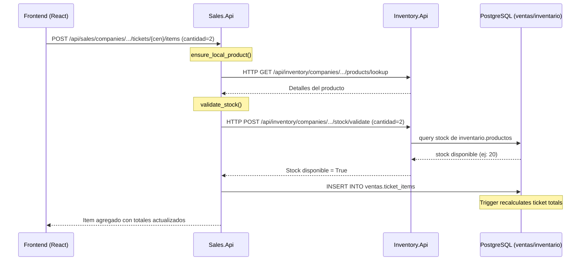
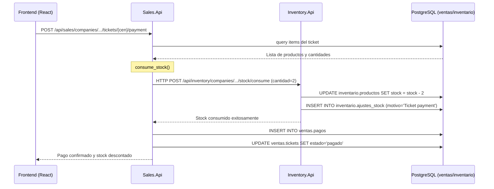

# Guía Técnica de Desarrollo - Restaurante PDV (PostgreSQL & Microservicios)

Esta guía documenta los detalles de arquitectura, base de datos y flujos lógicos del sistema Restaurante PDV distribuido.

---

## 🏗️ Arquitectura del Sistema

El sistema está diseñado bajo una arquitectura de microservicios distribuidos compuesta por tres APIs independientes en Flask que comparten una base de datos centralizada en PostgreSQL dividida en múltiples esquemas lógicos y una interfaz de usuario interactiva construida en React + Vite.

### 🌐 Ecosistema de Directorios

```
PDV-Restaurante/
├── Inventory.Api/              # API de Catálogo e Inventario (Puerto 5143)
│   ├── app.py                  # Servidor de Flask
│   ├── database.py             # Capa de datos PostgreSQL y search_path
│   ├── requirements.txt        # Dependencias de Python
│   └── routes/                 # Endpoints de productos, categorías y stock
├── Sales.Api/                  # API de Ventas, KDS y Facturación (Puerto 5074)
│   ├── app.py                  # Servidor de Flask
│   ├── database.py             # Capa de datos PostgreSQL y search_path
│   ├── inventory_client.py     # Cliente HTTP para consultar a Inventory.Api
│   └── routes/                 # Endpoints de tickets, comandas y reportes
├── Purchases.Api/              # API de Compras y Proveedores (Puerto 5229)
│   ├── app.py                  # Servidor de Flask
│   ├── database.py             # Capa de datos PostgreSQL y search_path
│   ├── inventory_client.py     # Cliente HTTP para sumar inventario
│   └── routes/                 # Endpoints de compras y proveedores
├── database/                   # Recursos de base de datos
│   ├── postgres_schema.sql     # Script DDL de esquemas, vistas, triggers y semilla para pgAdmin
│   └── verify_distributed.py   # Suite de pruebas de integración distribuida
├── frontend/                   # Aplicación Web React + Vite (Puerto 5173)
├── start.bat                   # Script de arranque para entornos Windows
└── start.sh                    # Script de arranque para entornos Unix
```

---

## 🗂️ Diseño de Base de Datos y Esquemas en PostgreSQL

La base de datos **`pdv_restaurante`** está segmentada en esquemas lógicos para aislar los recursos de cada microservicio pero permitir la comunicación relacional mediante llaves foráneas:

### 1. Esquema `public`
- **`empresas`**: Tabla global de control de empresas asociadas al sistema.

### 2. Esquema `inventario` (Dominio de `Inventory.Api`)
- **`categorias`**: Categorías de productos.
- **`unidades`**: Unidades de medida.
- **`productos`**: Catálogo físico de productos (precios, stock actual).
- **`ajustes_stock`**: Auditoría de movimientos de almacén (entrada/salida).

### 3. Esquema `ventas` (Dominio de `Sales.Api`)
- **`configuracion`**: Configuración global de tasas de impuestos (IVA).
- **`clientes`**: Clientes del negocio.
- **`tickets`**: Cuentas de ventas creadas.
- **`ticket_items`**: Ítems añadidos a las cuentas.
- **`pagos`**: Registro de facturación e ingresos.
- **`estaciones`**: Puntos de preparación KDS (Cocina/Bar).
- **`comandas`**: Órdenes enviadas a KDS.
- **`comanda_items`**: Estado individual de preparación de platillos.
- **Triggers**: Función y trigger `ventas.update_ticket_totals()` (PL/pgSQL) para recalcular montos al añadir items.
- **Vistas**: `v_ventas_hoy`, `v_top_productos` y `v_comandas_estado` para dashboard.

### 4. Esquema `compras` (Dominio de `Purchases.Api`)
- **`proveedores`**: Catálogo de proveedores.
- **`compras`**: Órdenes de compra de mercadería.
- **`compra_items`**: Detalle de productos ordenados.

---

## 🔄 Resolución Dinámica de Tablas mediante `search_path`

Para que el código de las consultas SQL permanezca genérico e intercambiable, cada microservicio define su variable `DB_SEARCH_PATH` en el archivo `.env`. Al establecer una conexión, la capa `database.py` inyecta esta variable en la sesión de PostgreSQL. 

El orden de búsqueda prioriza el esquema local del servicio antes de caer en otros esquemas:
- **Inventory.Api**: `search_path=inventario,public`
- **Sales.Api**: `search_path=ventas,inventario,public` (resuelve tablas de ventas, lee productos de inventario y empresas de public).
- **Purchases.Api**: `search_path=compras,inventario,public` (resuelve compras, lee productos de inventario y empresas de public).

---

## ⚙️ Flujos de Comunicación y Negocio

### 1. Registro de Venta con Validación de Stock


### 2. Confirmación de Pago y Descuento de Stock


---

## 🧪 Testing y Verificación Distribuida

### Pruebas de Integración con Python
El script automatizado [verify_distributed.py](database/verify_distributed.py) ejecuta una simulación completa de negocio:
1. Valida el estado de salud (`/health`) en las 3 APIs.
2. Recupera e identifica productos y la empresa predeterminada.
3. Abre un ticket de ventas, asocia un producto por HTTP e inicia el flujo de facturación.
4. Confirma que el decremento de stock en PostgreSQL se aplique por llamadas cruzadas.

Ejecútalo desde la raíz del proyecto estando los servidores activos:
```bash
python database/verify_distributed.py
```

### Con cURL (Verificación de API)
```bash
# Health checks
curl http://localhost:5143/health
curl http://localhost:5074/health
curl http://localhost:5229/health

# Crear categoría (Inventory.Api)
curl -X POST http://localhost:5143/api/inventory/companies/9f2a4e4e-ac9d-46a4-98ea-412d1c168d12/categories \
  -H "Content-Type: application/json" \
  -d '{"name":"Platillos Especiales"}'
```

---

## 🔒 Seguridad y Entorno de Producción
- **CORS**: Habilitado de forma selectiva para orígenes de desarrollo (`http://localhost:5173`, `http://localhost:3000`).
- **Control de Inyecciones**: Toda consulta SQL utiliza marcadores de posición parametrizados `%s` gestionados por el driver `psycopg2`.
- **Intercambiabilidad de Módulos**: Al no utilizar SQLite localmente y basar la comunicación en contratos HTTP API, cualquier microservicio puede reemplazarse por una implementación en otro lenguaje (ej. C# .NET o Node.js) sin alterar las demás piezas.
